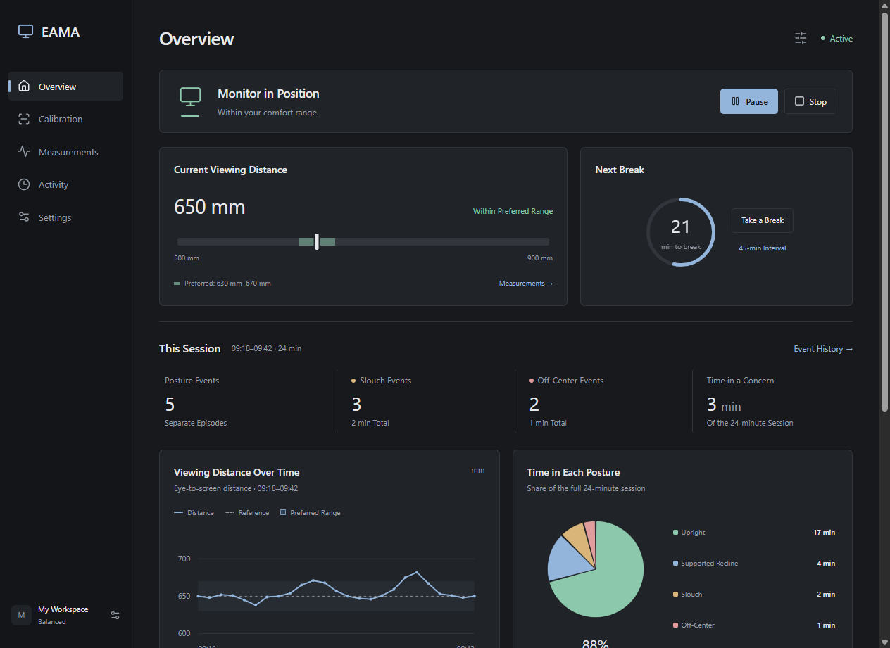

# EAMA Desktop

A compact Windows interface for the EAMA ergonomic monitor project.

**[Download EAMA.exe](https://github.com/sadadhaidari/eama-desktop/releases/latest/download/EAMA.exe)** · [All release files](https://github.com/sadadhaidari/eama-desktop/releases/latest)

Open the EXE directly. There is no installer, administrator prompt, startup task, or local server. Requires Windows 10/11 x64 and the [Microsoft Edge WebView2 Evergreen Runtime](https://developer.microsoft.com/microsoft-edge/webview2/), which is already present on many Windows devices.

This version contains interactive sample data. It does not use a camera, recognize posture, or control motors. Controls change the local interface only. Settings reset when the window closes.

## Interface

- Dark and light themes, text size, contrast, and distance units.
- Current viewing distance with preferred bounds.
- Four session charts: viewing distance, time in each posture, event frequency, and event duration.
- Clickable chart points, slices, and bars with filtered event history.
- Calibration review, response presets, reminder controls, and feedback previews.
- Operating-state examples for tracking, movement, pause, recovery, and faults.



## Small Windows Package

The native C++ shell embeds the React interface in one executable. It uses the installed WebView2 runtime instead of bundling another browser. The application has no periodic polling or animation loop. The WebView2 runtime still uses memory and system resources.

Closing the window exits EAMA. WebView2 keeps its normal cache in `%LOCALAPPDATA%\EAMA\WebView2`. No account is required by the application. No camera or microphone permissions are granted.

The EXE is unsigned, so Windows may display an unknown-publisher warning. Published SHA-256 checksums identify the release files. Third-party licenses are included in the ZIP and embedded in the EXE; `EAMA.exe --licenses` displays them.

## Source and Build

Download **EAMA-Source.zip** from the release and extract it. The archive contains the complete React source, native shell, icon, manifest, lockfile, and build script. It excludes personal notes, dependencies, and local caches.

Install Node.js 22 or later, pnpm 10, and Visual Studio Build Tools with **Desktop development with C++** and a Windows SDK. From the extracted folder:

```powershell
pnpm install --frozen-lockfile
powershell -ExecutionPolicy Bypass -File desktop/build.ps1
```

The build downloads the pinned Microsoft WebView2 SDK from NuGet. It produces `releases/EAMA.exe`, a portable ZIP, and checksums. The SDK is needed only to build; the Evergreen runtime is needed to run.

```powershell
Start-Process releases/EAMA.exe -ArgumentList '--self-test', 'C:\EAMA-Test' -Wait
```

The self-test opens the compiled application, checks navigation, chart drill-down, pause/resume, appearance, layout, and idle changes, then writes a JSON result and screenshot. It closes the app when finished. This checks the interface, not device integration or ergonomic effectiveness.

## Future Device Integration

`src/contracts.d.ts` describes a proposed interface boundary. `src/session.js` and `src/fixtures.js` provide sample data. Replace those data sources with validated service events when the decision service exists. Keep sensing and motor control outside the React components. A button click must not substitute for controller acceptance, motion completion, or stop confirmation.

## Technical References

- [Microsoft: static WebView2 loader](https://learn.microsoft.com/en-us/microsoft-edge/webview2/how-to/static)
- [Microsoft: distribute an application with WebView2](https://learn.microsoft.com/en-us/microsoft-edge/webview2/concepts/distribution)
